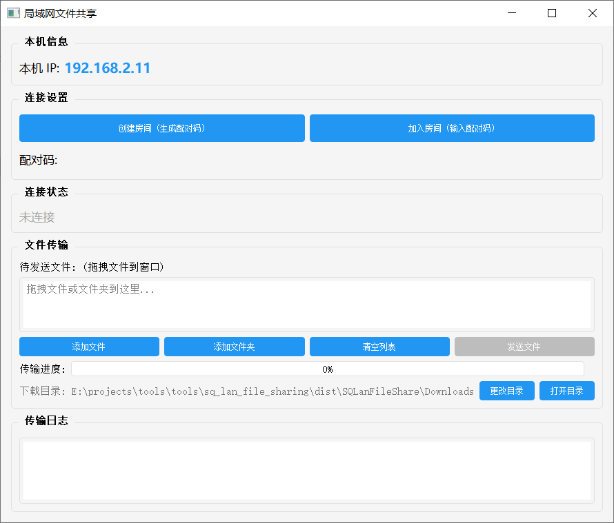

# SQ 局域网文件共享工具

一个简单易用的局域网文件共享工具，支持在局域网内快速传输文件和文件夹。



## 功能特性

- **设备发现**：自动发现局域网内的其他设备
- **配对验证**：通过6位配对码进行安全配对
- **文件传输**：支持发送单个文件或整个文件夹
- **断点续传**：支持传输中断后的断点续传
- **设备信任**：信任设备管理，免配对快速连接
- **进度显示**：实时显示传输进度

## 技术栈

- Python 3.x
- PyQt5（GUI界面）
- TCP/UDP 网络通信

## 目录结构

```
sq_lan_file_sharing/
├── main.py              # 程序入口
├── config.py            # 配置管理
├── file_handler.py      # 文件处理模块
├── network/             # 网络模块
│   ├── client.py        # 客户端
│   ├── server.py        # 服务端
│   ├── discovery.py     # 设备发现
│   ├── protocol.py      # 通信协议
│   └── reconnect.py     # 重连机制
├── transfer/            # 传输模块
│   ├── chunk_sender.py  # 分块发送
│   ├── chunk_receiver.py# 分块接收
│   └── state_manager.py # 状态管理
├── trust/               # 信任管理
│   └── device_manager.py
├── ui/                  # 界面模块
│   └── main_window.py   # 主窗口
└── requirements.txt     # 依赖列表
```

## 安装与运行

### 环境要求

- Python 3.8+
- PyQt5

### 安装依赖

```bash
pip install -r requirements.txt
```

### 运行程序

```bash
python main.py
```

### 打包为可执行文件

```bash
pyinstaller build.spec
```

打包后的可执行文件位于 `dist` 目录下。

## 使用说明

1. **启动程序**：在两台电脑上分别运行程序
2. **发现设备**：程序会自动发现局域网内的其他设备
3. **配对连接**：输入对方显示的6位配对码完成配对
4. **传输文件**：选择文件或文件夹，点击发送

## 配置说明

- 默认端口：9527（TCP）
- 发现端口：9528（UDP）
- 缓冲区大小：64KB
- 心跳间隔：10秒

## 许可证

MIT License
