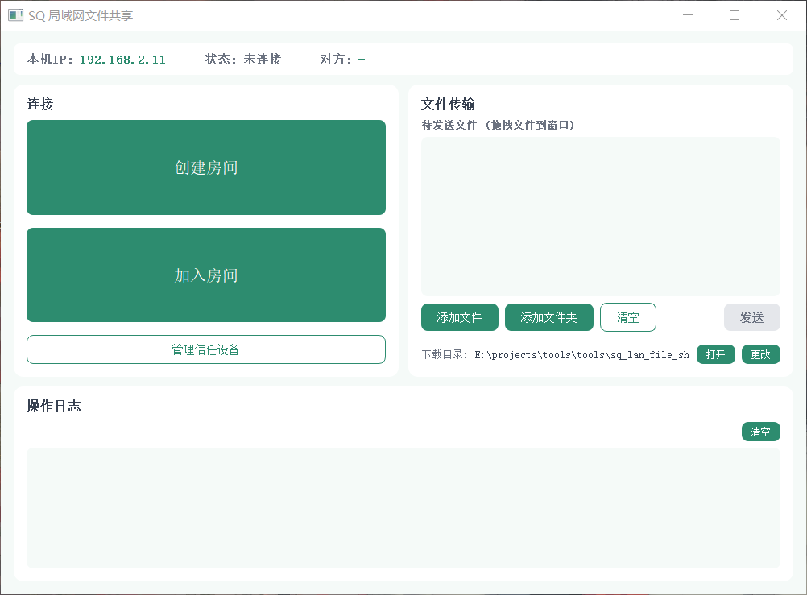

# SQ 局域网文件共享

局域网内高速文件传输工具，支持多文件并发传输、断点续传、设备信任管理。



## 功能特性

- **局域网设备发现** — UDP 广播自动发现同网段设备，也可手动输入 IP 连接
- **6 位配对码验证** — 首次连接需输入配对码，防止未授权访问
- **多文件并发传输** — 滑动窗口协议 + 线程池并发，默认 2 个文件同时传输
- **文件夹传输** — 自动打包为 ZIP 发送，保留目录结构
- **断点续传** — 传输中断后自动保存进度，重连后从断点继续
- **设备信任** — 配对成功后自动加入信任列表，下次免配对直连
- **自动重连** — 意外断线自动尝试重连，无需重新配对
- **实时进度** — 发送端聚合进度条，接收端每文件独立进度条

## 快速开始

### 环境要求

- Windows 10 及以上
- Python 3.8+

### 安装

```bash
pip install -r requirements.txt
```

### 运行

```bash
python main.py
```

### 打包

```bash
pyinstaller build.spec
# 或使用批处理脚本
build.bat
```

输出：`dist/SQLanFileShare.exe`

## 使用方法

### 方式一：创建房间

1. 点击「创建房间」，获得 6 位配对码
2. 将配对码告知对方
3. 对方输入配对码连接，或通过局域网扫描自动发现房间

### 方式二：加入房间

1. 点击「加入房间」，自动扫描局域网设备
2. 点击扫描到的房间，输入配对码连接
3. 也可手动输入 IP + 配对码连接

### 传输文件

- 拖拽文件/文件夹到窗口，或点击「添加文件」/「添加文件夹」
- 点击「发送」开始传输
- 传输完成后文件保存在下载目录中

### 信任设备

配对成功后设备自动加入信任列表。下次连接时无需配对码，直接自动连接。可在「管理信任设备」中移除。

## 项目结构

```
sq_lan_file_sharing/
├── main.py              # 入口：UI 模式选择、Windows 版本检查
├── config.py            # 配置常量与加载
├── file_handler.py      # 文件哈希、文件夹打包、临时文件管理
├── utils.py             # 工具函数
├── network/
│   ├── protocol.py      # 二进制协议编解码
│   ├── server.py        # TCP 服务器（接收端）
│   ├── client.py        # TCP 客户端（发送端）
│   ├── discovery.py     # UDP 广播发现
│   └── reconnect.py     # 心跳管理与自动重连
├── transfer/
│   ├── session.py       # 传输会话协调（多文件并发）
│   ├── chunk_sender.py  # 滑动窗口分块发送
│   ├── chunk_receiver.py# 分块接收与组装
│   └── state_manager.py # 断点续传状态持久化
├── trust/
│   └── device_manager.py# 设备身份与信任列表
├── ui/
│   ├── main_window.py   # PyQt5 主窗口
│   ├── bridge.py        # Web UI 桥接
│   └── web_window.py    # Web UI 窗口
└── requirements.txt
```

## 技术参数

| 参数 | 默认值 |
|------|--------|
| TCP 端口 | 9527 |
| UDP 发现端口 | 9528 |
| 分块大小 | 256 KB |
| 滑动窗口 | 64 块 |
| 并发文件数 | 2 |
| 心跳间隔 | 10 秒 |
| 心跳超时 | 60 秒（传输中 180 秒） |
| 最大重连次数 | 10 次 |

## 许可证

MIT License
